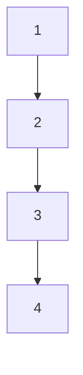

import { LinkCard, Tabs, TabItem, Steps } from "@astrojs/starlight/components";
import LinkPreview from "@components/LinkPreview.astro";
import MermaidChart from "@components/MermaidChart.astro";
import Table from "@components/Table.astro";

## ブロックによるスコープの理解

関数や変数の宣言が行われる場所をブロックと呼びます。
関数の外で宣言された変数、関数、定数、型はパッケージブロックに置かれます。
`import` 文は他のパッケージをインポートして、そのパッケージ内の識別子を利用できるようにします。

```go
package main

import "fmt"

func main() {
  // fmt パッケージの Println 関数を呼び出しています。
  fmt.Println("Hello, World!")
}
```

`import` 文によってほかのパッケージからインポートされた識別子はファイルブロックに置かれます。
関数のトップレベルで宣言された変数、定数、型は関数ブロックに置かれます。ひとつの関数では `{}` でブロックを表します。また、制御構造である、`if` 文や `for` 文、`switch` 文、`goto` 文はブロックを形成し、その内側のブロックでは外側で宣言された変数、定数、型を参照できます。

### 変数のシャドーイング

Go の特殊性で、ブロックの中で外で宣言している識別子と同じ名前の変数、定数、型を宣言すると、外側で宣言された変数、定数、型をシャドーイングします。

```go
package main

func main() {
  x := 10
  {
    x := 20
    // ここでは内側の x を参照しています。
    fmt.Println(x) // 20
  }
  // ここでは外側の x を参照しています。
  // シャドーイングされているため、内側の x は参照できません。
  fmt.Println(x) // 10
}
```

内側で宣言された変数をシャドーイング変数と呼びます。
パッケージのインポートのシャドーイングも注意しないといけません。

```go
package main

import "fmt"

func main() {
  fmt.Println("Hello, World!")
  fmt := 10
  fmt.Println(fmt) // fmt.Println undefined (type int has no field or method Println)
}
```

fmt がシャドーイングされているため、fmt.Println はエラーになります。

#### シャドーイングを防ぐ

リンターの shadow をインストールすれば、ある程度検出してシャドーイングを防ぐ助けになります。

```bash frame=none
go install golang.org/x/tools/go/analysis/passes/shadow/cmd/shadow@latest
```

[`Makefile`](/golang/base/10_basic/#makefile) に以下を追加します。

```makefile frame=none
vet:
  go vet ./...
  shadow ./...
.PHONY: vet
```

shadow コマンドを実行する

```bash frame=none
shadow xxx.go
```

:::note
shadow コマンドは、シャドーイングされている変数、定数、型を検出してエラーを出します。
パッケージ名を同じ名前の変数でシャドーイングした場合は検出されません。
:::

:::tip[ユニバースブロック]

Go 言語は小さな言語で、キーワードを 25 個しか持っておりません。
組み込みの型、パッケージ、関数、定数、変数、型、インターフェース、メソッド、セクションなどはそのキーワードに含まれていません(nil なども)。それらはユニバースブロックに置かれます。
キーワードではなく、あらかじめ宣言された識別子(predeclared identifiers)として扱われ、ユニバースブロックでこれらを定義して、ほかのすべてのブロックはユニバースブロックに含まれます。

ユニバースブロックで定義されているということは、シャドーイングの対象になるということでもあります。

```go
fmt.Println(true) // true
true := 10
fmt.Println(true) // 10
```

ユニバースブロックにある識別子を再定義できてしまうので十分注意が必要です。

:::

## if 文

Go 言語の条件文は、`if` 文、`else if` 文、`else` 文で構成されています。
条件文を `()` で囲みません。
if の制御ブロック内で宣言した変数はそのブロック内で有効となります。

```go
package main

func main() {
		score := 100
		if score > 80 {
				println("あなたの点数は" + score + "です")
		}
}
```

```go
package main

import (
	"fmt"
	"math/rand" // 乱数を生成するパッケージ
	"time" // 時間を取得するパッケージ
)


func main() {
	rand.Seed(time.Now().UnixNano()) // シードの指定
	n := rand.Intn(10) // 0以上10未満の整数を戻す
	if n == 0 {
		fmt.Println("少し小さすぎます:", n)
	} else if n > 5 {
		fmt.Println("大きすぎます:", n)
	} else {
		fmt.Println("いい感じの数字です:", n)
	}
}
```

パッケージ math/rand は乱数を生成するパッケージです。最初に `rand.Seed(time.Now().UnixNano())` でシードを指定しています。これは、`1970 年 1 月 1 日 0 時 0 分 0 秒`からの経過時間をナノ秒単位で取得しています。

条件式部分で、変数を宣言することもできます。

```go
package main

func main() {
  if x := 10; x > 0 {
    fmt.Println("xは正の数です")
  }
}
```

必要な時だけ、変数を宣言して利用できるようにします。 if 文が終わると、その変数は未定義となります。

```go
package main

func main() {
  if x := 10; x > 0 {
    fmt.Println("xは正の数です")
  }
  fmt.Println(x) // undefined: x
}
```

## for 文

Go 言語の for 文は、4 種類のみです。

### 標準形式の for 文

初期設定、条件、再設定の 3 つの部分を指定する。

`for 初期化; 条件式; 再設定 {` で始まります。それぞれの式は `;` で区切ります。

```go
for i := 0; i < 10; i++ {
  fmt.Println(i)
}
```

- **初期化**

  - 例: `i := 0`
  - ループに入る前に、ひとつあるいは複数の変数の値を設定
  - 変数の初期化には `:=` を必ず使用(var を使用できない)

- **条件式**

  - 例: `i < 10`
  - ループの継続条件(bool 型の式)を指定
  - 評価のタイミングは、初期化後と、ループブロックが実行され再設定する前
  - 評価結果が true の場合はループブロックを実行

- **再設定**

  - 例: `i++`
  - ループブロックが実行された後、条件が評価される前に実行される処理を指定

  ```go
  // デクリメントする処理
  for i := 5; i > 0; i-- {
    fmt.Println(i)
  }
  // 5
  // 4
  // 3
  // 2
  // 1
  ```

### 条件のみの for 文

条件文のみを指定します。標準形式の for 文の初期化と再設定を省略することができます。
C 言語の while 文に似ています。
ループの継続条件がループブロックの処理で必ず終了するようにしないと無限ループが発生してしまう。

```go
i := 0
for i < 10 {
  fmt.Println(i)
  i++
}
```

### 無限ループ

`条件のみの for 文`のさらに条件式もない場合は無限ループとなります。

```go
for {
  fmt.Println("無限ループ")
}
```

強制的に終了しないと無限ループになります。
ブロック内で `break` 文をなどを実行してループを終了させる必要があります。

#### break と continue

##### break

`break` 文はループを終了させます。
`continue` 文はループの処理をスキップして、ループの先頭に戻ります。(次のループに進む)

```go
for i := 0; i < 10; i++ {
  if i == 5 {
    break
  }
  fmt.Println(i)
}
```

無限ループの終了には `break` 文を使用します。

```go
for  {
  // 何かの処理
  if !<ループの継続条件> {
    break
  }
}
```

##### continue

`continue` 文はループの処理をスキップして、ループの先頭に戻ります。(次のループに進む)

continue を使用しない場合の for 文(FizzBuzz)

```go
for i := 0; i < 10; i++ {
  if i%3 == 0 {
    if i%5 == 0 {
      fmt.Println("3 と 5 の倍数です")
    } else {
      fmt.Println("3 の倍数です")
    }
  } else if i%5 == 0 {
    fmt.Println("5 の倍数です")
  } else {
    fmt.Println(i)
  }
}
```

この書き方は、イディオム的ではないため、コードのネストを深くしてしまうと可読性が低下してしまいます。チームによってはコードのネストは 2 つまでにしておくというルールがあったりします。そのため、回避できるのであれば、`continue` 文を使用してコードを簡潔にします。

```go
for i := 0; i < 10; i++ {
  if i%3 == 0 && i%5 == 0 {
    fmt.Println("3 と 5 の倍数です")
    continue
  }

  if i%3 == 0 {
    fmt.Println("3 の倍数です")
    continue
  }

  if i%5 == 0 {
    fmt.Println("5 の倍数です")
    continue
  }

  fmt.Println(i)

}
```

この方が、コードのネストが浅くなり、可読性が高くなります。
また、if の条件が同じレベルになるためそういった意味合いでも可読性が高くなります。

### for-range 文

Go の組み込み型の各要素に対して、繰り返し処理を行うためのものです。for-range ループと呼びます。
文字列、配列、スライス、マップ、チャネルに対して使用できます。
for-range 文は、`for インデックスまたはキー, 要素またはバリュー := range コレクション {` で始まります。

```go
for i, v := range []int{1, 2, 3} {
  fmt.Println(i, v)
}
```

ループブロック内で、インデックスまたはキーへのアクセスが不要な場合は、`_` を使用して無視することができます。

```go
for _, v := range []int{1, 2, 3} {
  fmt.Println(v)
}
```

#### スライス型に対する for-range

スライスに対して使用すると、インデックスと要素の値を取得できます。

```go
for i, v := range []int{1, 2, 3} {
  fmt.Println(i, v)
}
// 0 1
// 1 2
// 2 3
```

#### 文字列型に対する for-range

文字列に対して使用すると、インデックスと要素の値を取得できます。

```go
for i, v := range "Hello" {
  fmt.Println(i, v)
}
// 0 72
// 1 101
// 2 108
// 3 108
// 4 111
```

#### マップ型に対する for-range

マップに対して使用すると、キーと値を取得できます。

```go
for k, v := range map[string]int{"a": 1, "b": 2, "c": 3} {
  fmt.Println(k, v)
}
// a 1
// b 2
// c 3
```

#### チャネル型に対する for range

チャネルに対して使用すると、チャネルから受信した値を取得できます。
[for-range-とチャネル](/golang/base/19_concurrent-processing/#for-range-とチャネル) で詳しく説明しています。

```go
for v := range chan {
  fmt.Println(v)
}
```

#### キーは必要だが、値は利用しない

キーは必要だが、値は利用しない場合は、`_` を使用して無視することができます。

```go
for k := range map[string]int{"a": 1, "b": 2, "c": 3} {
  fmt.Println(k)
}
// a
// b
// c
```

#### マップのイテレーション

マップを for-range 文で実行した時には毎回、出力されるキーバリューの順番が異なります。

```go
m := map[string]int{
	"a": 1,
	"c": 3,
	"b": 2,
}

for i := 0; i < 3; i++ {
	fmt.Println("ループ", i)
	for k, v := range m {
		fmt.Println(k, v)
	}
}

fmt.Println(m)
```

宣言したマップの順番通りに出力されません。

```
ループ 0
b 2
a 1
c 3
ループ 1
a 1
c 3
b 2
ループ 2
c 3
b 2
a 1
map[a:1 b:2 c:3]
```

これはセキュリティを考慮した仕様です。Go の初期のバージョンでは、マップに挿入した順で、キーと値が出力されていました。
これには、以下の問題がはらみます。

- 順番が固定されているとそれを仮定したコードが発生する恐れがあります。しかし、このマップとキーの順が宣言された通りに保守され続けることは保証されません。
- マップの裏で作られるハッシュがいつも同じ対応になっていると、それを利用した「Hash DoS」攻撃が発生する恐れがあります。それはサーバーの動作を妨害することができます。すべてのキーが同じバケットにハッシュされるよう作られたデータが送信されます。[ハッシュマップ](/golang/base/12_golang-composite-type/#マップの特徴) で詳しく説明しています。

こうした問題を防ぐために、2 つの変更を施しました。

1. マップのハッシュアルゴリズムを乱数を利用して同じにならないようにした。
1. マップに対する for-range のイテレーションの順番を毎回変えるようにした

`fmt.Println(m)` で出力する際には、宣言した内容と同じ順番で出力されるため、デバッグなどには有用です。

#### 文字列を対象にしたイテレーション

```go
samples := []string{"hello", "apple_π!", "これは漢字文字列"}
for _, sample := range samples {
	for i, r := range sample {
		fmt.Println(i, r, string(r))
	}
	fmt.Println()
}
```

**"hello"** に対する出力結果は以下のようになります。

```
0 104 h
1 101 e
2 108 l
3 108 l
4 111 o
```

**"apple_π!"** に対する出力結果は以下のようになります。

```txt {7}
0 97 a
1 112 p
2 112 p
3 108 l
4 101 e
5 95 _
6 960 π
8 33 !
```

これを見ると、

- インデックス `0〜5` は各文字が 1 バイトで表現されています。
- インデックス 6 は`π`の最初のバイトを指し、インデックス 7 は`π`の 2 番目のバイトを指します。
- 次の文字`"!"`はインデックス 8 から始まります。

インデックスの出力形式で、`6 960 π` の行で、`π` の文字コードが 960 となっています。
これは、`π` の Unicode コードポイントです。これは 1 バイトを超えたマルチバイト文字列です。UTF-8 の表現を 32 ビットの数値に変換しています。

このように、`range`による文字列のイテレーションでは、インデックスは文字ではなく**バイトオフセット**を示しているため、マルチバイト文字が存在するとインデックスが跳ねることになります。

インデックスが文字位置ではなくバイト位置であることを理解することが重要です。

この挙動を理解することで、文字列処理やバイト操作を行う際に誤ったインデックス参照を防ぐことができます。

**"これは漢字文字列"** に対する出力結果は以下のようになります。

```txt
0 12371 こ
3 12428 れ
6 12399 は
9 28450 漢
12 23383 字
15 25991 文
18 23383 字
21 21015 列
```

このように、インデックスは文字ではなくバイトオフセットを示しているため、マルチバイト文字が存在するとインデックスが跳ねることになります。

#### for-range の値はコピー

for-range が合成型に関してイテレーションする際にはいつも、合成型の各要素の値が変数にコピーされていることに注意してください。コピーされた変数の値を変更しても、元々の合成型の値は変わりません。

```go
evenVals := []int{2, 4, 6, 8, 10, 12}
for _, v := range evenVals {
	v *= 2
}

//forブロック内で、値を変更しても、元々の合成型の値は変わらない
fmt.Println(evenVals) // [2 4 6 8 10 12]
```

### ラベル

break や continue キーワードで、for 文のループブロックから抜けることができますが、時にはネストされたループ処理から一気に抜けたい場合があります。その際にラベルを使用します。

```go showLineNumbers {7, 12}
package main

import "fmt"

func main() {
	samples := []string{"hello", "apple_π!", "これは漢字文字列"}
outer:
	for _, sample := range samples {
		for i, r := range sample {
			fmt.Println(i, r, string(r))
			if r == 'l' || r=='は' {
				continue outer
			}
		}
		fmt.Println()
	}
}
```

出力結果

```txt {3, 7, 10}
0 104 h
1 101 e
2 108 l
0 97 a
1 112 p
2 112 p
3 108 l
0 12371 こ
3 12428 れ
6 12399 は
```

7 行目の `outer:` がラベルです。(ラベルはトップレベルのループのインデントより浅くなります)
二重にネストされたループ処理から、条件式に一致した場合に、`continue outer` で外側のループに戻ります。(`"l"` と `"は"` の場合に `continue outer` が実行されます)

:::tip[ラベル付きのループの利用例]

```go
outer:
	for _, innerValues := range outerValues {
		for _, innerVal := range innerValues {
      // <innerVal> を利用した何らかの処理
			if invalidSituation(innerVal) {
        // <innerVal> の値で失敗した場合
				continue outer
			}
		}
    // <innerVal> の値の全てに対する処理が成功した場合の処理を実装
	}
```

このように、指定した値の検証に失敗したときなどの例外処理を実装するときなどにラベル付きのループを利用することができます。

:::

### どの for 文を利用するか

もっともよく使われるのは、for-range 文です。文字列のすべての要素について処理するのには for-range 文が最適です。バイトではなく、 rune 単位で処理してくれます。
for-range はスライスやマップの全要素についてイテレーションするのにも使えます。
並行処理の for-range は、チャネルから受信した値をイテレーションするのに使えます。

標準形式の for 文は線形アルゴリズムにおけるコレクションに対して有用です。
最初と最後の要素を処理しないなどイディオムに触れてみましょう。

これを for-range で実装すると以下のようになります。

```go
evenVals := []int{2, 4, 6, 8, 10}
for i, v := range evenVals {
  if i == 0 {
    continue
  }
  fmt.Println(i,v)
  if i == len(evenVals) - 2 {
    break
  }
}
// 1 4
// 2 6
// 3 8
```

こちらを標準形式の for 文で実装すると以下のようになります。

```go
evenVals := []int{2, 4, 6, 8, 10}
for i := 1; i < len(evenVals) - 1; i++ {
  fmt.Println(i, evenVals[i])
}
// 1 4
// 2 6
// 3 8
```

このように、for-range 文よりも標準形式の for 文の方がシンプルに記述できます。
マルチバイト文字を扱う場合は、for-range 文にしてください。

## switch 文

### switch 文の基本構文

ほかの言語でも switch 文は存在しますが、Go の switch 文は他の言語とは少し異なります。
switch 文の基本構文は以下の通りです。

```go
switch <式> {
case <式>:
  <処理>
case <式>:
  <処理>
default:
  <処理>
}
```

特徴としては、

- フォールスルーがない
- ブロック内で利用する変数を宣言できる
- 型アサーションがない
- switch と case のインデントは同じ深さになる

#### 一番シンプルな switch 文

```go
switch 1 {
case 1:
  fmt.Println("1")
case 2:
  fmt.Println("2")
default:
  fmt.Println("default")
}

// 1
```

#### 変数宣言を利用した switch 文

`switch 変数宣言; 一致する値` で変数宣言して、その値と case の値が一致した場合に処理が実行されます。
しかし、Go 言語の switch 文はもう少し、器用です。
以下は、複数の値を case で一度に評価する例です。

```go showLineNumbers {12, 13, 17}
package main

import (
	"fmt"
	"unicode/utf8" // utf8.RuneCountInString(word)で、wordの文字数を数えられる
)

func main() {
	words := []string{"山", "sun", "微笑み", "人類学者", "モグラの穴", "mountain",
		"タコの足とイカの足", "antholopologist","タコの足は8本でイカの足は10本"}
	for _, word := range words {
		switch size := utf8.RuneCountInString(word); size {
		case 1, 2, 3, 4:
			fmt.Printf("「%s」の文字数は%dで、短い単語だ。\n", word, size)
		case 5:
			fmt.Printf("「%s」の文字数は%dで、これはちょうどよい長さだ。\n", word, size)
		case 6, 7, 8, 9:
		default:
			fmt.Printf("「%s」の文字数は%dで、とても長い。", word, size)
			if n := len(word); size < n {
				fmt.Printf("%dバイトもある！\n", n)
			} else {
				fmt.Println()
			}
		}
	}
}
```

出力結果

```txt
「山」の文字数は1で、短い単語だ。
「sun」の文字数は3で、短い単語だ。
「微笑み」の文字数は3で、短い単語だ。
「人類学者」の文字数は4で、短い単語だ。
「モグラの穴」の文字数は5で、これはちょうどよい長さだ。
「antholopologist」の文字数は15で、とても長い。
「タコの足は8本でイカの足は10本」の文字数は16で、とても長い。42バイトもある！
```

<Steps>

1. 12 行目で swich ブロック内で利用する変数 `size` を宣言しています。case 節内で `size` を利用しています。

1. 各 case では、フォールスルーはしません。(言語によっては、case 節内の処理に入った場合、break を記述しないと、次の case 節の処理も実行されてしまう。)

1. 複数の値の条件にマッチした場合は、case 節をカンマで区切ることで複数の値にマッチすることができます。(13、17 行目)

1. 17 行目の `case 6, 7, 8, 9:` でマッチした場合はその後の処理がないため何もしません。

1. default 節は、case 節にマッチしなかった場合に実行されます。

</Steps>

:::tip[switch 文の利用例]

`utf8.RuneCountInString(word)` で word の文字数を数えられます。
ただ、例えば 「å」を UTF-8 を使って表現する方法は、一つのコードポイントを使うものと、
2 つのコードポイントを使うものの 2 種類があります。
後者の場合は `utf8.RuneCountInString("å")` は 2 になっています。

github.com/rivo/uniseg をインポートして、uniseg.GraphemeClusterCount(word) とすると、一般的な意味の文字数 --- 書記素(grapheme)の数 --- を返してくれます。
たとえば uniseg.GraphemeClusterCount("å") はコードポイントの数に関係なく 1 になります。

:::

:::tip[fallthrough キーワード]

Go の switch 文では、フォールスルーがないので、fallthrough キーワードを利用して、次の case 節の処理を実行することができます。

```go
switch 1 {
case 1:
  fmt.Println("1")
  fallthrough
case 2:
  fmt.Println("2")
}
```



:::

### ブランク switch

ブランク switch は、case 節に式がない switch 文です。
通常の swich では値が一致するかを case 節で評価しますが、ブランク switch では論理式での評価ができます。

```go showLineNumbers {3} /wordLen\s*[<>]=?\s*\d+/
words := []string{"hi", "salutations", "hello"}
for _, word := range words {
	switch wordLen := len(word); { // 比較対象の変数の指定なし
  // 論理式での評価ができる
	case wordLen < 5:
		fmt.Println(word, "は短い単語です")
	case wordLen > 10:
		fmt.Println(word, "は長すぎる単語です")
	default:
		fmt.Println(word, "はちょうどよい長さの単語です")
	}
}
```

```txt
hi は短い単語です
salutations は長すぎる単語です
hello はちょうどよい長さの単語です
```

<Steps>

1. 3 行目で switch ブロック内で利用する変数 `wordLen` を宣言していますが、一致する値を空にしていて渡していません。

1. case 節内で宣言した `wordLen` を利用した論理式で評価します。

</Steps>

ブランク switch は完全一致する値に対しての論理式での利用は控えるべきです。  
以下のような書き方は適していないです。

```go
switch a := 1; {
case a == 1:
  fmt.Println("1")
case a == 2:
  fmt.Println("2")
default:
  fmt.Println("default")
}
```

### break を使う時

[break の利用方法](/golang/base/13_shadow-if-for-switch-goto/#break-と-continue)は for 文で述べたとおりです。

switch で break を使う時は、ループ処理内で、switch を利用している場合です。

```go
outer:
  for _, word := range words {
    switch wordLen := len(word); {
    case wordLen < 5:
      fmt.Println(word, "は短い単語です")
    case wordLen > 10:
      fmt.Println(word, "は長すぎる単語です")
      break outer
    default:
      fmt.Println(word, "はちょうどよい長さの単語です")
    }
  }
```

case での条件にマッチしたら即座にループから抜け出すときに利用できます。これは無駄な ループ処理、線形探索での探索が終了した時に利用するなどが挙げられます。

#### break を使う時の注意点

```go
for i := 0; i < 10; i++ {
		switch {
		case i%2 == 0:
			fmt.Println(i, ": 偶数")
		case i%3 == 0:
			fmt.Println(i, ": 3で割り切れるが2では割り切れない")
		case i%7 == 0:
			fmt.Println(i, ": ループ終了...はしない！")
			break
		default:
			fmt.Println(i, ": 退屈な数")
		}
	}
```

こちらを実行すると、以下の出力結果になります。

```txt
0 : 偶数
1 : 退屈な数
2 : 偶数
3 : 3で割り切れるが2では割り切れない
4 : 偶数
5 : 退屈な数
6 : 偶数
7 : ループ終了...はしない！
8 : 偶数
9 : 3で割り切れるが2では割り切れない
```

これは beak をただ入れるだけでは、case から抜け出すだけで、ループを抜けることはできません。ループから抜け出すには、ラベルを利用して、ループを抜けるようにします。

```go
loop:
	for i := 0; i < 10; i++ {
		switch {
		case i%2 == 0:
			fmt.Println(i, ": 偶数")
		case i%3 == 0:
			fmt.Println(i, ": 3で割り切れるが2では割り切れない")
		case i%7 == 0: //liststart2
			fmt.Println(i, ": ループ終了！")
			break loop //listend2
		default:
			fmt.Println(i, ": 退屈な数")
		}
	}
```

```txt
0 : 偶数
1 : 退屈な数
2 : 偶数
3 : 3で割り切れるが2では割り切れない
4 : 偶数
5 : 退屈な数
6 : 偶数
7 : ループ終了！
```

:::note[if か switch か]

機能面で見た場合に、if も switch も同じです。
そのため、どちらを使うかは各条件の文に関連性があるかどうかで判断しましょう。

以下の if 文の条件は n に対する評価値になっていますので、switch で表現するべきでしょう。

```go
rand.Seed(time.Now().UnixNano()) // シードの指定
n := rand.Intn(10) // 0以上10未満の整数を戻す
if n == 0 {
	fmt.Println("少し小さすぎます:", n)
} else if n > 5 {
	fmt.Println("大きすぎます:", n)
} else {
	fmt.Println("いい感じの数字です:", n)
}
```

swich に置き換え

```go
rand.Seed(time.Now().UnixNano())
switch n := rand.Intn(10) {
case n == 0:
	fmt.Println("少し小さすぎます:", n)
case n > 5:
	fmt.Println("大きすぎます:", n)
default:
	fmt.Println("いい感じの数字です:", n)
}
```

関連性のない条件(case)がある場合は、if 文で表現した方が良いでしょう。

:::

## goto

古の制御フローとも思われる goto 文は Go 言語に存在していますが、利用用途はかなり限られてくると言っていいでしょう。

[Go To Statement Considered Harmful](https://homepages.cwi.nl/~storm/teaching/reader/Dijkstra68.pdf)

goto はプログラムの中のどこにでもジャンプできてしまうため、流れを追うのが難しくなります。

```go
func main() {
	a := 10
	goto skip
	b := 20 // goto skip jumps over declaration of b at ./prog.go:10:4
skip:
	c := 30
	fmt.Println(a, b, c)
	if c > a {
		goto inner // goto inner jumps into block starting at ./prog.go:17:11
	}
	if a < b {
	inner:
		fmt.Println("aはbより小さい")
	}
}
```

このプログラムを実行すると、以下のようなエラーが発生します。

```txt
goto skip jumps over declaration of b at ./prog.go:10:4
goto inner jumps into block starting at ./prog.go:17:11
```

基本的にこのような使い方は break や continue をつかって実現できます。

例外的に goto を利用できるパターンを見てみましょう

```go
package main

import (
	"fmt"
	"math/rand"
	"time"
)

func main() {
	rand.Seed(time.Now().Unix()) // シードの指定
	a := rand.Intn(10)
	for a < 100 {
		fmt.Println(a)
		if a%5 == 0 {
			goto done
		}
		a = a*2 + 1
	}
	fmt.Println("ループが通常終了したときに行う処理を実行")
done:
	fmt.Println("ループが終わったときに必ず行う処理を実行")
	fmt.Println(a)
}
```

```txt
3
7
15
ループが終わったときに必ず行う処理を実行
15
```

実際に goto を利用しているコードを見てみましょう。
[floatBits](https://github.com/golang/go/blob/842e4b5207003db692d72a1aeba4f164bbeb1c13/src/strconv/atof.go#L314) では、goto を利用しています。

フラグを利用して、goto の代わりに for を使うのも同様かそれ以上に保守しづらい状況になるのであれば、goto を利用した方が良いでしょう。
