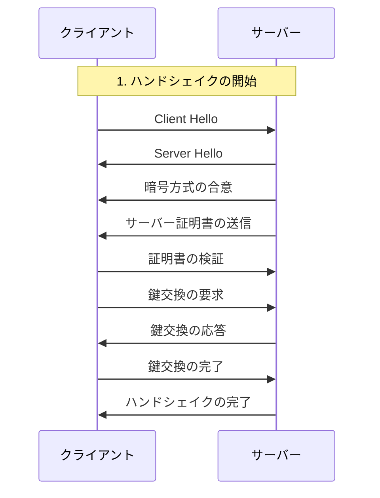
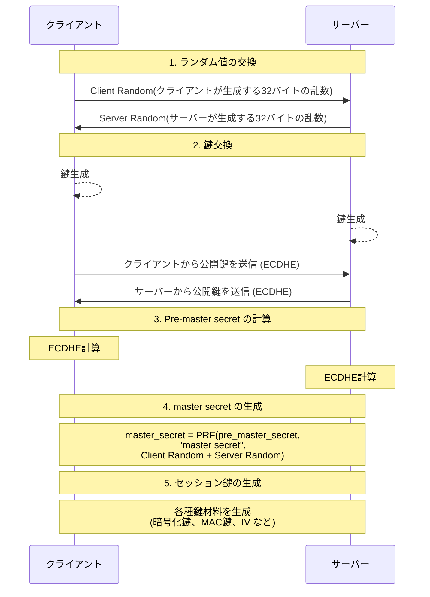
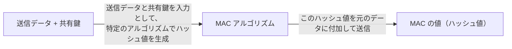
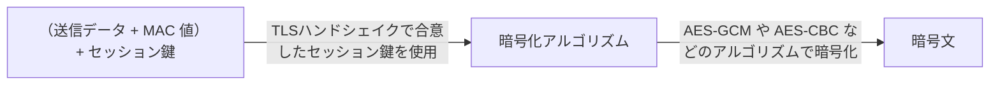

import { LinkCard, Tabs, TabItem, Steps, FileTree } from "@astrojs/starlight/components";
import LinkPreview from "@components/LinkPreview.astro";
import Table from "@components/Table.astro";
import SimpleTable from "@components/SimpleTable.tsx";
import MermaidChart from "@components/MermaidChart.astro";

## HTTPS の仕組み

HTTPS は HTTP プロトコルに TLS/SSL 暗号化を使用した通信方式です。
HTTPS 通信では、リクエストとレスポンスの内容を暗号化します。

<Table
  caption="HTTP・HTTPS の比較"
  columns={["", "HTTP", "HTTPS"]}
  colWidth={["20%", "40%", "40%"]}
  data={[
    [
      "暗号化",
      "データは平文で送受信されるため、ネットワーク上で容易に傍受・改竄されるリスクがあります。",
      "TLS/SSL プロトコルを使用して通信を暗号化するため、データの秘匿性と改ざん防止が実現され、セキュアな通信が可能です。",
    ],
    [
      "認証",
      "認証機能が組み込まれていないため、サーバーやクライアントの真正性を確認する仕組みは基本的にありません。",
      "サーバーはデジタル証明書を使用して自身を認証します。これにより、クライアントは接続先が正当なサーバーであることを確認できます。",
    ],
  ]}
  isRowFirstHeader={true}
/>

### HTTP リクエストが実行されるまでの流れ

<Steps>

1. **クライアントがブラウザアドレスバーに URL を入力、または、ハイパーリンクをクリックします。**

1. **URL 情報 (例: https://www.example.com/path )を解析し、プロトコル名(HTTPS)、ドメイン名(example.com)、パス(/path)を取得します。HTTPS の場合はデフォルトではポート 443 と解析します。**

1. **ブラウザはドメイン名を DNS サーバーに問い合わせて IP アドレスを取得します。(名前解決)**

   1. まずは、ブラウザ内部や OS レベルでのキャッシュがあれば、そこで IP アドレスを取得します。
   1. キャッシュがない場合は、OS 内で、設定されている DNS サーバー( resolv.conf で記載されている)に問い合わせて IP アドレスを取得します。(DNS レスポンス)
   1. 取得した IP アドレスはブラウザのキャッシュに保存されます。(DNS キャッシュ)

1. **取得した IP に対して TCP コネクションを確立します。(TCP ハンドシェイクを実行)**

   以下の 3 つのステップで TCP ハンドシェイクが行われる

   1. SYN: クライアントからサーバーに接続要求（SYN パケット）を送信
   1. SYN-ACK: サーバーからクライアントに接続確認（SYN-ACK パケット）を送信
   1. ACK: クライアントからサーバーに接続確認（ACK パケット）を送信

   これにより、コネクションの確率がされる。

1. **[TLS（暗号化通信）ハンドシェイク](#tls-ハンドシェイク)**

   1. **Client Hello**:

      - クライアントがサポートするプロトコルバージョン(TLS バージョン)
      - 暗号スイート
      - 圧縮方式
      - クライアント乱数(Client Random (32 バイトの乱数))
      - そのほかの拡張情報

      をサーバーに送信します。

   1. **Server Hello & 証明書送付**:

      - サーバーが選択したプロトコルバージョン(TLS バージョン)
      - サーバーが選択した暗号スイート
      - サーバー乱数(Server Random (32 バイトの乱数))
      - そして自身のサーバー証明書(通常は X.509 形式 の証明書および必要であれば中間証明書)

      をクライアントに送信します。

      :::note[Client Random と Server Random]
      Client Random と Server Random で生成された乱数は後続の鍵生成プロセスに使用されセッションの一意性の保証、リプレイ攻撃の防止、につながります。
      また、Master Secret、Pre-Master Secret の生成にも使用されます。
      :::

   1. **証明書チェーンの構築**: クライアントは受け取ったサーバー証明書から、中間証明書、最終的には信頼済みルート証明書までの証明書チェーンを構築します。

   1. **デジタル署名の検証**: 各証明書について、対応する証明書発行元（Issuer）の公開鍵を使ってデジタル署名が正しいかどうかをチェックします。これにより、送信された証明書が改ざんされていないことが確認されます。

   1. **証明書の有効性チェック**: 証明書が有効期限内であるか、また、証明書に記載されたドメインと接続先のホスト名が一致しているかどうかを検証します。

   1. **検証結果の評価(TLS 接続の確立)**: 全てのチェックが成功すれば、安全な TLS 接続が確立されます。検証に失敗した場合、通常は警告が表示されるか、接続自体が中止されます。

   1. **鍵交換とセッション鍵の生成**: クライアントはサーバーの証明書を検証し、合意された方法（例：ECDHE、RSA など）で鍵交換を行い、共通のセッション鍵を生成します。(通信内容の暗号化・復号化に使用)

   1. **Finished メッセージ:**: クライアントとサーバーはそれぞれハンドシェイクの完了を通知し、以降の通信は暗号化されたチャンネル上で行われます。

1. **HTTP リクエストの送信**

   TLS セッション上で、クライアントは HTTP GET などのリクエストを送信します。アプリケーション層（ブラウザなど）が、通常のプレーンテキストの HTTP リクエスト（例：GET、POST など）を作成します。

   ```
   GET /path HTTP/1.1
   Host: www.example.com
   User-Agent: ブラウザ情報
   Accept: text/html, application/xhtml+xml, application/xml;q=0.9
   ...

   ```

   構成は以下のようになります。

   1. **リクエストライン:** HTTP リクエストの最初の行
      - HTTP メソッド: `GET`
      - リクエスト URL: `/path`
      - HTTP バージョン: `HTTP/1.1`
   2. **ヘッダー:**
      - `Host`: ホスト名
      - `User-Agent`: ブラウザの情報
      - `Accept`: 受け入れるメディアタイプ
      - `Accept-Encoding`: 受け入れるエンコーディング
      - `Accept-Language`: 受け入れる言語
      - `Connection`: 接続の保持
      - `Cookie`: クッキー
      - `Upgrade-Insecure-Requests`: 不安全なリクエストをアップグレード

   :::note

   最後の行は空行として、ヘッダーの終了を示します。GET リクエストでは通常、本文（Body）は含まれませんが、仕様上は空行以降に本文を含むことも可能です（あまり一般的ではありません）。

   API や Web サービスを呼び出す場合、`Cache-Control`、`Authorization` などの追加ヘッダーが必要になることが多いです。

   :::

   このようなリクエスト情報は暗号化されていない状態で送信を行うと、悪意はなくても接続セッションを監視している第三者によってリクエストとレスポンスの内容を読み取ることができます。特に Cookie や Authorization ヘッダーには重要な情報が含まれているため、漏洩した場合はセキュリティ上のリスクが高まります。(パスワード、クレジットカード番号、そのほかフォームで送信した内容なども)これは、HTTP 通信の脆弱性です。(Man-in-the-Middle 攻撃による盗聴)

1. **TLS レコード層への渡し**
   TLS ではレコード(サイズは 16384 バイト)と呼ばれる単位でデータを扱い、各レコードは次のような多層構造になっています。

   - コンテンツタイプ

     レコードの種類を指定、例えば、ハンドシェイクやアプリケーションデータ

   - レコード長
   - メッセージデータ

     暗号化されたメッセージやカプセル化されたサブプロトコルデータ。例えば、コンテンツタイプが「ハンドシェイク」の場合、このレコード層のメッセージデータの中にさらにハンドシェイクタイプ・メッセージ長・メッセージといった構造を持ちます。

   HTTP リクエストのプレーンテキストは TLS のアプリケーションデータとして、TLS レコード層に渡されます。  
   TLS レコード層は、送信データを必要に応じて断片化（フラグメント化）し、各フラグメントに対して以降の処理を行います。

1. **MAC の計算とデータの整形**

   [MAC(Message Authentication Code)](#macmessage-authentication-code)

   - TLS 1.2 などの場合、各フラグメントごとに、あらかじめ交渉済みの MAC 鍵を使ってメッセージ認証コード（MAC）が計算されます。
   - 計算した MAC がプレーンテキストに付加され、データ全体の整合性チェックができるようにします。

   ※ TLS 1.3 や一部の AEAD 暗号スイートの場合は、MAC と暗号化が一体になっているので、この処理は内部で管理されます。

1. **暗号化処理**

   TLS ハンドシェイクで合意された対称鍵（セッション鍵）と初期化ベクトル（IV）を用い、各レコードが暗号化されます。例として AES-GCM や AES-CBC などの暗号アルゴリズムで暗号化され、平文と MAC（または AEAD の場合は認証タグ）が含まれた状態で暗号文が生成されます。

1. **TLS レコードの形成**

   暗号化されたデータは TLS レコードとしてラップされます。各レコードには、ヘッダー（Content Type、TLS バージョン、長さ）が付加され、たとえば「Application Data」（アプリケーションデータ）としてマークされます。

1. **暗号化通信路を通じた送信**

   暗号化済みの TLS レコードは、既に確立された TCP コネクション（ポート 443 など）を通じてサーバーへ送信されます。この時点で、ネットワーク上に流れるデータはすべて暗号化されているため、第三者には内容が解読できません。

1. **サーバー側での復号と HTTP リクエストの処理**

   サーバーは受信した TLS レコードのヘッダー情報を確認し、既に合意済みのセッション鍵と IV を用いてデータを復号します。
   復号後、MAC や認証タグを検証し、データの整合性と真正性が守られているかを確認します。
   チェックが成功すると、元の HTTP リクエスト（プレーンテキスト）が復元され、サーバーの HTTP レイヤーで処理されます。

1. ページのレンダリングに必要な情報 HTTP レスポンスが返却される

</Steps>

HTTP レスポンス

```
HTTP/1.1 200 OK
Date: Wed, 30 Jan 2019 12:14:39 GMT
Server: Apache
Last-Modified: Mon, 28 Jan 2019 11:17:01 GMT
Accept-Ranges: bytes
Content-Length: 12
Vary: Accept-Encoding
Content-Type: text/plain
```

## TLS ハンドシェイク

<LinkPreview url="https://qiita.com/shun_takagi/items/eb46e0c1f0bb512fa04d" />

TLS とは Transport Layer Security の略で、HTTP 通信を暗号化するためのプロトコルです。
TLS は、SSL の後継で、より安全で信頼性の高い通信を提供します。ネットワーク層でいうと、プレゼンテーション層に位置し、データ転送時には上層から受け取った平文を暗号化処理して下層に転送、逆にデータ受信時には下層から暗号データを受け取り、複合して上層(アプリケーション層)に転送します。

TLS は、以下のような手順で通信を行います。

### ハンドシェイク

セキュアな通信を実現するために、クライアント ←→ サーバー間で一連の通信の開始を準備するためのセッションがあります。これをハンドシェイクといい、認証・暗号化方式の合意、秘密鍵共有する目的があります。



### 鍵交換の方式

#### RSA 鍵交換

1. クライアントがランダムな Pre-Master Secret を生成
1. サーバーの公開鍵（証明書内）で暗号化して送信
1. サーバーは自身の秘密鍵で復号

#### DHE/ECDHE（Diffie-Hellman/Elliptic Curve DH Ephemeral）

1. 一時的な鍵ペアを使用（Perfect Forward Secrecy の実現）
1. お互いの公開値を交換し、各自で共通の秘密を計算
1. 現在は ECDHE が推奨（より効率的で安全）

### セッション鍵の生成プロセス



### サーバー証明書

サーバー証明書は、サーバーの正当性を証明するためのものです。
この証明書は、サーバーの公開鍵と、信頼された認証局（CA）による署名を含んでいる必要があります。

証明書には、署名されたデータとその署名の検証に使う署名アルゴリズム・発行者情報（Issuer）が含まれています。これらを用いて、下記のように証明書が認証局（CA）によって正当に署名されたものかどうかを検証できます。

#### 発行者情報の確認

Issuer フィールドには、発行者の名前や組織情報が記載されています。ブラウザやクライアントは、あらかじめ信頼できる CA のリスト（ルート証明書ストア）を持っており、証明書の Issuer がそのリストにあるかを確認します。

#### デジタル署名の検証

##### 署名の仕組み

証明書には、発行者が保持する秘密鍵で署名されたハッシュ値が含まれます。
クライアントは、対応する CA の公開鍵を使い、この署名を検証して、証明書の内容が改ざんされていない（＝真正である）ことをチェックします。

##### 証明書チェーン

通常、サーバー証明書は中間 CA を経由し、最終的にルート CA の自己署名証明書まで遡るチェーン構造になっています。このチェーン全体が正しいか、かつルート CA が信頼できるものであれば、サーバー証明書が正当に認証局から発行されたという証明になります。

##### コマンドラインでの検証

OpenSSL を使って証明書の署名を検証する方法です。

```bash
# /etc/ssl/certs/ca-certificates.crt にはシステムが信頼するルート証明書が格納されています。
openssl verify -CAfile /etc/ssl/certs/ca-certificates.crt server.crt
```

## 暗号化の仕組み

TLS(Transport Layer Security)/SSL(Secure Sockets Layer) は以下のような暗号化の仕組みを使用しています。

- 公開鍵暗号方式
- セッション鍵暗号方式

### MAC(Message Authentication Code)

MAC（Message Authentication Code）は、メッセージの完全性（改ざんされていないこと）と認証（送信者が正しいこと）を確認するための仕組みです。

#### MAC の基本的な仕組み

##### 生成時



送信データは、HTTP リクエストや、HTTP レスポンスのことです。
計算された MAC 値は「データが改竄されていない」ことを証明する値です。

送信されるデータは MAC 値で組み立てられ暗号化します。



##### 検証時

```
受信データ + 共有鍵 → MACアルゴリズム → MACの値
↓
送信時のMACと一致するか確認
```

- 受信側で同じ共有鍵を使って同じ計算を行い
- 計算結果が送信されてきた MAC と一致するか確認

#### MAC の役割

1. **完全性の確認**

   - データが通信中に改ざんされていないことを保証
   - もし改ざんされていれば、MAC の値が一致しなくなる

2. **認証**
   - 正しい共有鍵を持つ送信者からのメッセージであることを確認
   - 共有鍵を知らない第三者は正しい MAC を生成できない

#### TLS での利用

- TLS 1.2 では、MAC と暗号化が別々のステップで行われます
- TLS 1.3 では、AEAD（認証付き暗号）を採用し、MAC と暗号化が一体化されています

このように、MAC はセキュアな通信において、データの完全性と認証を確保する重要な役割を果たしています。
