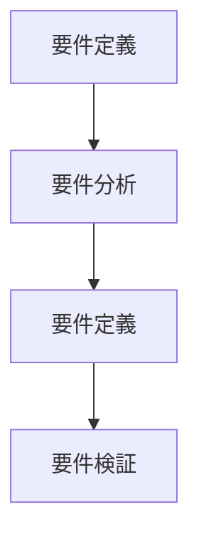

## 要件定義

システム開発の流れとしてウォーターフォールモデルを採用している場合、要件定義はシステム開発の最初のフェーズです。

```mermaid
graph TD;
    A[要件定義] --> B[要件分析]
    B --> C[要件定義]
    C --> D[要件検証]
```

### 要件定義の目的

- システムの目的を明確にする
- システムの要件を明確にする
- システムの要件を満たすためのアーキテクチャを決定する

### 要件定義のフェーズ

- 要件定義
- 要件分析
- 要件定義
- 要件検証
